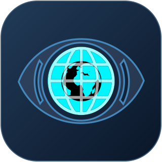

<div align="center">

<a href="https://github.com/WmjXiaoJun/GEV">
  
</a>

<h1>God's Eye View</h1>

<p><strong>GEV · 3D Geospatial Intelligence &amp; AI Workspace</strong></p>
<p>Public data · 3D awareness · Local vision · Multi-provider AI</p>

<p>
  
  
  
  
  
  
  
</p>

<p>
  <a href="https://github.com/WmjXiaoJun/GEV"><strong>Project GitHub</strong></a> ·
  <a href="https://github.com/bilawalsidhu/gods-eye-view"><strong>Upstream GitHub</strong></a> ·
  <a href="https://github.com/bilawalsidhu">Created by Bilawal Sidhu</a> ·
  <a href="#acknowledgements">Acknowledgements</a>
</p>

<p><a href="README.md">简体中文</a> · <strong>English</strong></p>
<p>
  <a href="#quick-start">Quick start</a> ·
  <a href="#features">All features</a> ·
  <a href="#buildings">Building recognition</a> ·
  <a href="#configuration">Configuration</a> ·
  <a href="#architecture">APIs and structure</a> ·
  <a href="#troubleshooting">Troubleshooting</a>
</p>

</div>

---

Bring public geographic data, 3D maps, target tracking, AI chat, voice control, and image recognition into one browser workspace. Move from a global view into a city, inspect loaded flights, vessels, satellites, and infrastructure, analyze the current viewport, draw annotations, and export reports.

This version builds on [Bilawal Sidhu / God's Eye View](https://github.com/bilawalsidhu/gods-eye-view), adding Chinese and English interfaces, multiple AI providers, local speech and voiceprints, YOLO vision, building-outline fusion, terrain analysis, and an intelligence workspace. The features below describe the current code; they do not imply that every data source is configured or continuously available.


<a id="quick-start"></a>
## Quick start

### Requirements

| Component | Requirement |
| --- | --- |
| Node.js | `>=24.14.0 <25` or `>=26 <27`; see `package.json` for the authoritative range |
| Browser | A modern desktop browser with WebGL support; voice requires microphone permission, and browser transcription support varies |
| Python | Python 3.11+ for the optional local vision and speech services |
| Network | Required for online maps, data sources, remote models, and initial model downloads; local inference does not make the entire platform offline |
| Hardware | 3D maps require graphics support; local models can run on a CPU, with speed depending on the model, scene, and hardware |

### 1. Start the main application

Clone this repository first. The application lives directly at the repository root:

```powershell
git clone https://github.com/WmjXiaoJun/GEV.git
cd GEV
npm install
npm run doctor
npm run dev -- --host 127.0.0.1 --port 4173 --strictPort
```

Open [http://127.0.0.1:4173](http://127.0.0.1:4173). Keep this terminal running. `--strictPort` prevents a silent switch to another port when the requested port is occupied. The basic globe can use Esri satellite imagery and OSM basemaps without API keys. 3D cities, some layers, cloud AI, and search require additional configuration.

### 2. Start local vision and speech (Windows, optional)

Open another PowerShell terminal in the same application directory. On first use, install the dependencies and models:

```powershell
powershell -ExecutionPolicy Bypass -File scripts/local-vision/setup.ps1
powershell -ExecutionPolicy Bypass -File scripts/local-speech/setup.ps1
```

For subsequent runs, just start the services:

```powershell
powershell -ExecutionPolicy Bypass -File scripts/local-vision/start.ps1
powershell -ExecutionPolicy Bypass -File scripts/local-speech/start.ps1
```

The scripts launch the services in the background and check readiness. They retain healthy instances and do not terminate unknown processes occupying a port. Logs are stored in `.gev-logs/`. Vision weights usually load on the first recognition request; a successful health check does not mean model inference has already completed.

Building-specific weights differ from general-purpose weights. Check that `models/vision/yolov8n-building-seg.pt` is installed. The general setup script downloads only official YOLO26 weights; the third-party `yolov8n-building-seg.pt` weights must be provided separately. See the [local vision guide](scripts/local-vision/README.md).

### 3. Services and health checks

| Service | Default address | Purpose |
| --- | --- | --- |
| GEV / Vite | [127.0.0.1:4173](http://127.0.0.1:4173) | UI and same-origin `/api/*` proxy |
| Local vision | `127.0.0.1:8766` | YOLO detection and segmentation |
| Local speech | `127.0.0.1:8765` | Whisper transcription and optional voiceprints |
| Firecrawl (optional, external) | `127.0.0.1:3002` | Local web search service |
| SearXNG (optional, external) | `127.0.0.1:58080` | Local search stack status checks |
| Agent Pro (optional, external) | `127.0.0.1:6637` | Reuse its search gateway |

```powershell
Invoke-WebRequest -UseBasicParsing http://127.0.0.1:4173/
Invoke-RestMethod http://127.0.0.1:4173/api/vision/health
Invoke-RestMethod http://127.0.0.1:8766/health
Invoke-RestMethod http://127.0.0.1:8765/health
Invoke-RestMethod http://127.0.0.1:4173/api/ai/local-services
```

The table lists default ports, not live service status. GEV does not install or automatically start Firecrawl, SearXNG, Agent Pro, or their database dependencies. Browser recognition requests reach the Python services through the GEV proxy rather than making direct cross-origin calls to the Python ports.

For Linux/macOS vision setup, see the [local vision guide](scripts/local-vision/README.md). Automated speech and voiceprint setup and startup scripts are currently verified on Windows; other platforms require the appropriate runtime libraries.

<a id="features"></a>
## All features

### 3D globe, maps, and navigation

- CesiumJS 3D globe with zoom, rotation, tilt, place search, preset city destinations, and a one-click return to the global view.
- Map sources include Esri Satellite, OSM, Google Photorealistic 3D, imagery supplied through Cesium ion, and Bing Aerial / Bing Labels. Availability depends on credentials and service permissions.
- Maps that require no API key remain an option when Google/Ion is unavailable; the globe can fall back to an ellipsoid when online terrain is unavailable.
- The HUD shows latitude/longitude, location, heading, and altitude. Terrain sampling and elevation datum handling support entity placement.
- First-run choices include Live Contacts, Space Missions, Environmental, and manual exploration.
- Switch between Simplified Chinese and English. Panels support collapsing, pinning, and compact layouts.
- Top-level controls include clearing selected layers, opening AI, drawing, sharing, toggling voice playback, and resetting the globe.

### Data layers and sources

Enable or disable layers as needed. Record counts vary with the viewport, source coverage, refresh time, and rendering limits; no fixed worldwide count is promised.

| Layer / capability | Content | Data characteristics and dependencies |
| --- | --- | --- |
| Flights | Position, callsign, speed, altitude, heading, and available flight information | OpenSky, with a geographically limited adsb.lol fallback when unavailable. Anonymous access is restricted; OpenSky credentials can be configured |
| Military Flights | Public ADS-B military aviation records and available historical tracks | adsb.lol; limited to targets observed by the source |
| Live AIS Vessels | Position, course, speed, vessel name, and voyage attributes supplied by the source | AISStream; requires `AISSTREAM_API_KEY`, with uneven coverage across sea areas |
| Satellites | Positions, orbit rings, tracking, and ISS pass queries | CelesTrak orbital elements + SGP4 propagation, rather than continuous live measurements |
| Space Missions | Launches from approximately the last 30 days, payloads, stages, and recovery information; timeline and replay | Launch Library 2; launch animations are labeled reconstruction estimates |
| Earthquakes | Events in the last 24 hours, magnitude, depth, and time | USGS online events |
| FIRMS active fires | Thermal anomalies/fire detections and available intensity attributes | NASA FIRMS; requires `FIRMS_MAP_KEY`. A thermal anomaly is not a verified disaster report |
| Street Traffic | Traffic animation on OSM roads and optional congestion colors | Simulated without a TomTom key; traffic flow data is used when a key is available. Moving particles still do not represent individual real vehicles |
| Public CCTV | Camera directory, images/video frames, and map projection | Integrated public sources with varying update rates and availability |
| Radio | Geolocated stations, category filtering, tuning, and playback | Radio Browser directory + each station's own audio stream |
| Bikeshare | Stations, vehicles, and available docks in integrated cities | GBFS; does not cover every station worldwide |
| Mapped Installations | Mapped facility names, categories, and extent information | OSM within the viewport, with optional Google Places candidates; does not establish real-world capability or activity |
| Global Context | Combined context for targets, facilities, and infrastructure | A composite view of loaded data, rather than a separate data source |
| Datacenters | Location, name, operator, and available classification attributes | Static OSM data snapshot |
| Dams | Location, name, and available facility attributes | Static OSM / OpenInfraMap data snapshot |
| Submarine Cables | Routes and landing points | Static TeleGeography snapshot, subject to noncommercial-use licensing restrictions |
| OSM themes | Addresses, buildings, roads, settlements, waterways, green spaces, and public facilities | Overpass queries within the viewport, with area and count limits; independent of AI building recognition |

Some OSM theme code is named `osm-us-themes`; actual coverage depends on OSM data. Queries for waterways, green spaces, public facilities, and similar features require a smaller viewport, so zoom in when the area is too large. Existing Natural Earth natural regions and San Francisco neighborhood boundaries can also support name resolution and boundary annotations.

### Target tracking, cockpit, and global context

- Click a target to inspect details, lock the camera to it, and display available tracks. Historical track completeness depends on the upstream source.
- Aircraft can use 3D aircraft models at close range, with near-range or all-model display policies.
- Cockpit follow mode displays heading, altitude, speed, and other telemetry, with visual mode switching and controls to exit tracking.
- Contacts lists loaded targets within approximately 250 km, with type filters and previous/next navigation.
- The cockpit briefing shows nearby signals, regional news, and local weather. Optional WX effects depict clouds, precipitation, and other conditions based on weather observations.
- Global Context organizes global layers and camera views, restoring the previous configuration when that mode is exited.
- Space Missions provides mission details, a replay timeline, and speed controls. Source records, orbital propagation, and estimated mission phases should be interpreted separately.

### Cameras and radio

- CCTV supports selection, previous/next camera, nearest camera, focus, automatic rotation, projection, and coverage toggles.
- Camera orientation can be calibrated, with coverage-volume and field-of-view demonstrations. Orientation and coverage are estimates rather than measured security-camera visibility.
- Radio offers category filters, an analog-style tuning dial, play/stop, previous/next, and volume controls, with compact access in the main panel and cockpit.
- Audio connects directly to the broadcaster. GEV does not record or redistribute it. Directory tags do not identify the program currently on air.

### Visual styles and interface controls

- Seven styles: Normal, Retro / CRT, Surveillance / NVG, Thermal / FLIR, Anime, Noir, and Snow.
- Tactical, Operator, and Minimal HUD layouts, with adjustable bloom, sharpening, and style parameters.
- Circular viewport, edge feathering, celestial rings, and a clean view for presentations and screen recording.
- Map entity boxes support density, label density, assignment policy, fading, and opacity controls.
- **Entity boxes come from loaded map objects; local YOLO is a separate recognition feature that analyzes image pixels.** Night-vision and thermal styles are rendering effects, not sensor measurements.

### Annotations, distances, routes, and manual drawing

- Draw points, routes, and areas manually. The draw button cycles through modes; double-click to finish a route or area.
- AI annotations support pins, labels, highlights, boundaries, routes, and arrows, with controls to clear drawings.
- Resolve administrative, natural-region, neighborhood, or facility boundaries using available geographic data. Missing data does not mean the area does not exist.
- Connect locations and explain distances; request walking, cycling, or driving routes based on road data.
- Realtime tools can fly along a drawn route, orbit a target, or perform continuous camera movements.

### Multiple AI models and voice interaction

- The AI workspace has four tabs: **Chat, Briefing, Watch, and Settings**, with streaming responses, stop generation, connection testing, and model configuration.
- Provider adapters support OpenAI, DeepSeek, Qwen, Moonshot / Kimi, Anthropic / Claude, Gemini, Ollama, and custom OpenAI-compatible services. Image and tool-calling capabilities depend on the specific model and API.
- The text assistant declares 15 tools covering view/entity/statistics queries, search, vision and building recognition, terrain analysis, terrain routes, navigation, layer/style controls, annotations, and clearing.
- OpenAI Realtime has a broader toolset, including cockpit, tracking, cameras, radio, scene direction, ISS passes, map sources, and post-processing controls. An arbitrary text model may not have the same tool access.
- The selected model can generate HUD summaries. Map questions use the entity and viewport data currently supplied to the model.
- State-changing actions in the standard assistant display a countdown of approximately three seconds, with options to execute immediately, cancel, and undo supported operations. Recognition results can be drawn automatically; execution behavior differs between voice entry points.
- Voice input supports browser transcription, reuse of compatible provider transcription APIs, a separate transcription service, and OpenAI Realtime. Voice response playback controls are available.
- Realtime offers model tiers, usage estimates, and session cost thresholds. Actual pricing and charges are determined by the provider.

### Local speech and optional voiceprints

- Faster-Whisper provides local multilingual transcription, using `small` by default. `medium` and `large-v3-turbo` can be installed separately.
- Chinese vocabulary hints, candidate search, and Simplified Chinese normalization are supported. Accuracy depends on accent, noise, and microphone quality.
- Optional CAM++ / `voice-detect.cpp` supports voiceprint enrollment from recordings or files, verification, deletion, threshold adjustment, and observe/enforce modes.
- Voiceprints are disabled by default. Enforce mode checks the match before transcription. When voiceprint checking is enabled, browser transcription and Realtime entry points that would bypass this path are blocked.
- Only voiceprint vectors are stored locally; raw recordings are not retained. The vectors remain unencrypted sensitive data. This is application-level voice filtering, not liveness detection or system login authentication.
- Locally transcribed text is still sent to the selected LLM. Using a remote LLM is not an entirely offline workflow.

### Local vision and building outlines

- Scan the current viewport with aerial OBB or general object detection. Adjust confidence, cancel requests, enlarge the preview, and inspect classes and confidence scores.
- The Python API supports `detect`, `obb`, `segment`, and `buildings-seg`. The general scanning UI primarily exposes the first two; buildings use a separate workflow.
- Local YOLO requires no chat-model API key. General COCO/DOTA models do not replace a building-specific model.
- The building workflow combines segmentation, overlapping crops, optional multimodal refinement, and missed-building detection, then projects and draws polygons on the map. See the next section.

### Briefings, snapshots, reports, and watched areas

- Summarize loaded objects in the current viewport with sources, counts, categories, and coverage status. Datacenters can be grouped by available operator, country, and usage attributes.
- Record tables support search, layer filtering, sorting, pagination, map location, and CSV export.
- Save viewport snapshots, compare new, missing, and moved records against a baseline, and draw comparison results. This compares data records, rather than automatically detecting changes in satellite imagery.
- Export viewport reports as JSON, CSV, or GeoJSON, or open a print page to save as PDF. GeoJSON primarily contains record location points; it is not a dedicated export path for building outlines.
- Save, rename, locate, pause, and delete watched areas. Set count thresholds and durations in the UI, view new-record alerts, mark them read/handled, and add notes.
- Watch state is stored in the current browser. Observation runs only while the page is visible, relevant data is loaded, and coverage is sufficient. There is no background monitoring or email delivery after the page closes.

### Terrain analysis and terrain routes

- Sample viewport elevations and show minimum, maximum, and average elevation, relief, slope, aspect, terrain type, and profiles.
- Draw sample points, contour lines, and classified colors on the map, with a slope legend.
- Plan a route within the sampled area from a start and destination subject to a maximum slope, returning distance, cumulative ascent/descent, and slope metrics.
- Routes are colored by slope and labeled with elevations. Grid sampling cannot establish real-world traversability and does not replace road, geological, or field surveys.

### Scene director and sharing

- Built-in shot recipes, with controls to create/delete scenes, capture/update shots, play/stop, and view progress.
- Import/export scene JSON and download run records. Capturing a shot saves scene state; producing a video requires a separate screen-recording tool.
- Share links preserve camera, style, layer, panel, and other state, and can include one tracked target. Recipients still need access to the relevant data sources.
- Clean view is suitable for presentations; required map and data attribution must still be retained.

<a id="buildings"></a>
## Building recognition: combining YOLO with LPM-inspired methods

```text
Current viewport imagery
  → Building-specific YOLO-seg: full-image detection + overlapping crops
  → Multimodal model: use candidates, refine outlines, independently find missed roofs (optional)
  → Polygon validation, overlap matching, and deduplicated fusion
  → Cesium surface projection and map drawing
  → Return model, detection/addition/drawing counts, and fallback status
```

- `yolov8n-building-seg.pt` is preferred. Full-image inference currently uses `imgsz=2048`, with up to four additional overlapping crops for larger images. Both count and size limits apply.
- The multimodal stage reuses the configured vision model. Inspired by LPM's normalized polygon sequence representation, it uses candidate outlines and searches for clear roofs that were missed.
- Available YOLO results are retained when refinement times out, is not configured, or returns invalid results. When local segmentation is unavailable, direct multimodal recognition may be attempted, with its status reported.
- Changing the viewpoint during recognition invalidates old results to prevent misaligned drawing. A single request returns at most 500 buildings and may return fewer; reaching the limit does not mean every building has been detected.
- **This version does not integrate official EarthVi/LPM weights or a SAM2 inference pipeline.** It is an engineering combination inspired by the paper, not a reproduction of its model, and does not claim the paper's metrics.
- **Building recognition does not associate OSM names, addresses, or attributes.** OSM thematic layers remain independent.
- Image quality, oblique views, occlusion, roof scale, and differences from the training domain can still produce false positives, missed buildings, and coordinate errors. These are experimental outlines, not cadastral deliverables.

Recommended workflow: choose clear satellite imagery, zoom until roofs are distinguishable, use a view as close to overhead as possible, wait for tiles to finish loading, and ask the AI chat to “Identify buildings in the current viewport.” Refinement requires a model that accepts images and returns structured coordinates. Text-only models or gateways without image support cannot perform this stage. Remote refinement sends viewport imagery to the selected service.

Paper: [Rethinking Language Models for Building Outline Extraction from Remote Sensing Imagery — Amazon Science / CVPR 2026 EarthVision](https://cdn.amazon.science/aa/3c/d4ea78084f199eaf08743fc57e50/scipub-approval152134-45892548-rethinking-language-models-for-building-outline-extraction-from-remote-sensing-imagery.pdf).

<a id="configuration"></a>
## Configuration and usage

### Keys and models

Use **POWER UP / Provider Settings** for maps and data sources, and **AI → Settings** for models, transcription, and search. If the provider settings entry is hidden, open it with `?setup=1`.

A normal development launch saves configuration to `.env` in the application directory. Pinokio uses `pinokio/ENVIRONMENT`; shell-provided configuration may appear as externally managed. For manual configuration, refer to [.env.example](.env.example) without overwriting an existing `.env`.

| Setting | Capability |
| --- | --- |
| `GOOGLE_MAPS_API_KEY` | Direct Google 3D tiles and place search |
| `CESIUM_ION_TOKEN` | ion assets and available 3D/terrain services |
| `OPENSKY_AUTH_MODE`, `OPENSKY_CLIENT_ID`, `OPENSKY_CLIENT_SECRET` | Flight authentication; use `anon` for unauthenticated access |
| `AISSTREAM_API_KEY` / `FIRMS_MAP_KEY` / `TOMTOM_API_KEY` | Vessels / fire detections / real traffic flow |
| `LL2_API_TOKEN` | Optional launch-data credentials |
| `GEV_LLM_PROVIDER`, `GEV_LLM_MODEL`, `GEV_LLM_BASE_URL` | Chat, tool calls, HUD, and optional image refinement |
| `OPENAI_API_KEY`, `DEEPSEEK_API_KEY`, `QWEN_API_KEY`, `MOONSHOT_API_KEY`, `ANTHROPIC_API_KEY`, `GEMINI_API_KEY` | Provider-specific credentials |
| `GEV_LLM_API_KEY` | Separate credentials for a custom OpenAI-compatible service |
| `GEV_STT_PROVIDER`, `GEV_STT_MODEL`, `GEV_STT_BASE_URL`, `GEV_STT_API_KEY` | Transcription service |
| `OPENAI_REALTIME_*` | Realtime model, voice, and context |
| `FIRECRAWL_API_KEY`, `FIRECRAWL_BASE_URL` | Cloud/local web search |
| `AGENT_PRO_SEARCH_ENABLED`, `AGENT_PRO_SEARCH_URL`, `AGENT_PRO_LOCAL_HEADER` | Local Agent Pro search |
| `GEV_YOLO_DEVICE` | Vision device; CPU by default, with CUDA / MPS available in compatible environments |
| `GEV_LOCAL_SPEECH_MODEL_ID`, `GEV_LOCAL_SPEECH_MODEL_PATH` | Weights actually loaded by local speech |
| `VOICEPRINT_*`, `VOICEDETECT_LIBRARY`, `VOICEDETECT_MODEL` | Voiceprint policies and runtime libraries; see the speech guide |

Google Maps and Cesium ion credentials are used in the browser by design; restrict their origins and permissions through the providers. Other private credentials are held on the server. Maps, models, search, and speech may be billed separately; the system should not be assumed to be permanently free.

### Custom gateways and local models

- Select `custom` for custom chat and enter the provider's API base URL, usually ending in `/v1`, the actual model ID, and the matching key. Do not enter a console webpage URL or append `/chat/completions` again.
- A successful chat connection does not establish compatibility with images, tool calls, or `/audio/transcriptions`; verify each separately.
- Ollama can use `http://127.0.0.1:11434/v1`. Install the model and start the service yourself.
- For local speech, select a separate transcription service with URL `http://127.0.0.1:8765/v1`, model `local-whisper-small`, and a blank key. Changing the actual weights requires installation and a service restart; changing the UI model name alone does not switch weights.
- For local Firecrawl, use `FIRECRAWL_BASE_URL=http://127.0.0.1:3002/v2`. A healthy SearXNG status does not establish that Firecrawl search is available.

### Common actions

| Entry point | Examples |
| --- | --- |
| AI chat | “Take me to Tokyo,” “Enable the flights layer,” “How many datacenters are in the current viewport?” |
| Building recognition | “Identify buildings in the current viewport” |
| Terrain | “Analyze the terrain in the current viewport,” then specify a start and destination to plan a terrain route |
| Realtime voice | “Track the nearest aircraft,” “Enter the cockpit,” “Play a nearby radio station,” “Fly along the route we just drew” |
| Briefing | Refresh viewport → Save snapshot → Compare → Export report |
| Watch | Save area → Set count/duration → View alerts on the page |

Keyboard shortcuts: `1`–`7` switch styles; `H` toggles the HUD; `O` controls orbit; `V` toggles clean view; `F` toggles the data panel; `D` switches entity detection mode. `C` toggles the cockpit when available, otherwise CCTV. Depending on the current state, `Esc` exits the cockpit, stops scene playback, or closes an overlay/search.

<a id="architecture"></a>
## APIs, structure, and development

```text
Browser: Cesium, UI, annotations, viewport analysis
  └─ Vite / Node same-origin proxy (default 4173)
       ├─ Maps, public data, selected LLM / Realtime / search
       ├─ Local YOLO (8766)
       └─ Local Whisper / optional voiceprints (8765)
```

| API group | Purpose |
| --- | --- |
| `/api/ai/config`, `/api/ai/test`, `/api/ai/chat`, `/api/ai/hud-summary` | AI status, connection testing, chat, summaries |
| `/api/ai/transcribe`, `/api/ai/voiceprint/*` | Transcription and voiceprint management |
| `/api/ai/search`, `/api/ai/local-services`, `/api/ai/diagnostics` | Search, service status, diagnostics |
| `/api/vision/health`, `/api/vision/detect` | Local vision status and detection |
| `/api/vision/buildings-seg`, `/api/vision/buildings` | Building segmentation and multimodal outline generation/refinement |
| `/api/terrain/heights`, `/api/terrain/analyze`, `/api/route` | Elevation, terrain, road routes |
| `/api/realtime/token`, `/api/google/*`, source-specific `/api/*` routes | Sessions, places, and layer proxies |
| `/api/setup/status`, `/api/setup/keys` | Configuration management in local development mode |

See the source for request methods, fields, and limits. These are internal application endpoints, not a general-purpose public GIS API.

```text
GEV/
├── README.md / README.en.md  # Chinese / English
├── index.html / style.css    # UI and styles
├── vite.config.js           # Development server and proxies
├── src/
│   ├── main.js / ui.js       # Startup and controls
│   ├── data/                # Data sources, tracks, weather, static data
│   ├── ai/                  # Models, vision, briefings, watches, reports
│   ├── voice/               # Transcription routing, Realtime, map actions
│   ├── annotations/         # Annotations, manual drawing, terrain styles
│   ├── scenes/ / styles/    # Scene director and visual effects
│   └── locale/              # Chinese and English text
├── scripts/local-vision/    # YOLO service
├── scripts/local-speech/    # Whisper and voiceprints
├── tools/building-extraction/ # Standalone building tools
├── models/                  # Local weights/runtime libraries (install separately; not distributed)
└── docs/CURRENT-STATE.md     # Implementation status
```

```powershell
npm run doctor
npm test
npm run test:track
npm run build
npm run preview
```

See the local service READMEs for Python test commands and [TESTING.md](TESTING.md) for UI regression scenarios. `npm run preview` previews the build; some proxy and configuration features are available only in the development server. Hosting `dist/` alone does not provide the full `/api/*` backend.

The Pinokio launcher in `pinokio/` starts only the web application and does not replace Python service installation. Use this repository for the custom features listed here.

<a id="troubleshooting"></a>
## Troubleshooting and limitations

| Symptom | What to check |
| --- | --- |
| Page will not open | Check the application directory, Node version, terminal process, and port 4173 occupancy |
| Blank map / 3D unavailable | Check network access and token permissions; switch to Esri / OSM. 3D coverage is not uniform worldwide |
| No data in a layer | Check keys, regional coverage, time window, rate limits, and source status. Empty data does not establish the absence of real-world targets |
| Vision disconnected | Run the vision `start.ps1`; check `.gev-logs/` and the proxy health endpoint |
| Healthy service but slow recognition | Weights load during the first inference. CPU performance and scene complexity affect latency; avoid duplicate concurrent requests |
| Missed buildings / refinement timeout | Check building weights and vision-model compatibility; reduce the area and improve the viewpoint. Review fallback results |
| No voice result | Check the microphone, STT path, and model identity; check the profile and mode if voiceprints are enabled |
| Gateway errors despite having a key | Verify the API base URL, model access, quota, tool calling, and image support |
| Search unavailable | Check the actual Firecrawl / Agent Pro endpoints; GEV does not start the external search stack |
| No watched-area alerts | Keep the page visible, enable the relevant layers, and load the area. The first observation usually establishes a baseline |

Data may be delayed, incomplete, static, or propagated. Image recognition, terrain routes, camera coverage, and track reconstruction should be checked against their sources. The platform supports exploration, education, presentations, and assisted analysis; it should not be the sole basis for survey acceptance, navigation, or safety-critical decisions.

<a id="acknowledgements"></a>
## Acknowledgements · God's Eye View

This project extends the open-source **God's Eye View** project. Thank you to its original author, **Bilawal Sidhu**, and the community contributors for the foundations: the 3D globe, public-data integrations, target tracking, cockpit, visual styles, voice operations, and scene director.

- Upstream GitHub: [bilawalsidhu/gods-eye-view](https://github.com/bilawalsidhu/gods-eye-view)
- Original author: [Bilawal Sidhu](https://github.com/bilawalsidhu)
- Upstream license: [MIT License](LICENSE); retain its copyright and license notices.
- This version adds Chinese/English UI, multiple AI providers, local speech and speaker verification, YOLO building recognition, terrain analysis, viewport briefs, and watched areas. These additions do not imply upstream endorsement of this custom version.

The header icon reuses the existing [public/logo.svg](public/logo.svg), adding only a background and PNG presentation for the documentation. Thanks also to CesiumJS, Vite, Ultralytics, faster-whisper, voice-detect.cpp, OpenStreetMap, and the other data/model maintainers. See [DATA_SOURCES.md](DATA_SOURCES.md) and the model documentation for sources and licensing.

<a id="license"></a>
## License, attribution, and documentation

- Application code retains the [MIT License](LICENSE) and the copyright notice for the original author, Bilawal Sidhu.
- Third-party data, 3D assets, and models have their own licenses and are not covered by the application's MIT license. TeleGeography includes noncommercial restrictions; OSM-derived data follows ODbL. Maps, news, weather, and other services are subject to provider terms.
- Ultralytics code/weights are subject to AGPL-3.0 or a separately offered license. Check the model card and authorization for third-party building weights.
- Do not commit keys, configuration, caches, or voiceprints to the repository. Git ignore rules do not prevent cloud-drive synchronization. Access defaults to loopback; see [SECURITY.md](SECURITY.md) for network-sharing boundaries.

| Document | Contents |
| --- | --- |
| [Chinese README](README.md) | Corresponding Chinese version |
| [Current implementation status](docs/CURRENT-STATE.md) | Feature paths and implementation details |
| [Data sources and attribution](DATA_SOURCES.md) | Sources, licensing, coverage, and simulation notes |
| [Local vision](scripts/local-vision/README.md) | Models, installation, APIs, limitations, and tests |
| [Local speech](scripts/local-speech/README.md) | Whisper, voiceprints, configuration, and privacy |
| [Model asset attribution](public/models/README.md) | 3D model sources and licenses |
| [Security](SECURITY.md) / [Testing](TESTING.md) | Deployment boundaries and validation scenarios |
| [Contributing](CONTRIBUTING.md) / [Changelog](CHANGELOG.md) | Collaboration and project history |

The standalone building-extraction CLI, tiled batch processing scripts, and GeoJSON viewer are in [`tools/building-extraction/`](tools/building-extraction/README.md), with Chinese and English usage instructions.
